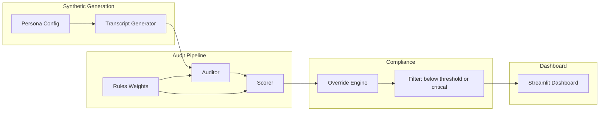

# Risk-Based Audit Explorer – Architecture & Modules

## Domain context

- **Collections agent**: Regulated collections (payment promises, settlements, redemption/repo, hardship). Persona 1.
- **Inside sales RAM**: Dealer relationship (portal guidance, paperwork, objections, pipeline, compliance). Persona 2.
- Synthetic transcripts and audits are **persona-specific** and produced in **English and Spanish**. Each transcript has **expected audit outcomes** (reasons for its risk level). The dashboard shows **why** each result is good, moderate, high, or critical.

---

## Persona 1: Auto Finance Collections Agent

**Role**: Regulated collections — payment promises, settlement negotiations, redemption after repo, hardship discussions.

**Required behaviors**

- **Opening**: Proper company greeting, agent name, Mini-Miranda when required, right-party verification.
- **During call**: Accurate account details, clear payment options, within-authority negotiations only, no threats or misrepresentation, proper hardship options if applicable, clear redemption amount (if repo).
- **Closing**: Recap of agreement, payment date + amount confirmation, disclosure reminder if required, professional closing.

**Common failure modes**

- Missing Mini-Miranda
- Third-party disclosure violation
- Aggressive or threatening tone
- Promising outside policy authority
- Misstating balance or fees
- No recap of arrangement
- No verification before discussing account
- Improper handling of disputes

**What good looks like**

- Clear regulatory compliance, controlled negotiation within policy, empathetic but firm tone, accurate payment agreement summary, clean closing, no legal or reputational exposure.

---

## Persona 2: Inside Sales RAM Team

**Role**: Dealer relationship — portal usage, paperwork requirements, objections, pipeline support, compliance adherence, relationship continuity.

**Required behaviors**

- **Opening**: Company + name greeting, dealer identification verification.
- **During call**: Step-by-step portal guidance, accurate documentation checklist, no policy workarounds, clear underwriting guardrails, busy-season expectation setting, calm objection handling, confirm dealer understanding.
- **Closing**: Summary of next steps, confirm required documents, support contact path, professional closing.

**Common failure modes**

- Advising policy bypass
- Incorrect documentation guidance
- Overpromising turnaround time
- Contradicting underwriting rules
- No confirmation of understanding
- No recap
- Transactional tone harming relationship

**What good looks like**

- Clear portal navigation, accurate compliance alignment, strong relationship tone, structured explanation, proper documentation confirmation, professional close, dealer confidence maintained.

---

## High-level architecture

---

## Proposed modules

### 1. **Personas & configuration**

- **Purpose**: Define who we’re generating and auditing (contact-center vs RAM), and what “good” looks like.
- **Contents**:
  - Persona definitions (e.g. contact-center agent, RAM agent) with traits, typical scripts, and risk areas.
  - Optional: dealer/customer archetypes for RAM vs contact-center scenarios.
- **Artifacts**: Config files (YAML/JSON) or a small config module. You can plug in your detailed agent and RAM personas here to drive generation and rules.

*You mentioned you can provide more details on contact-center agents and the RAM team – those will feed this module (prompts, scenario lists, and later audit rule wording).*

---

### 2. **Synthetic transcript generator**

- **Purpose**: Produce realistic call transcripts for Collections and RAM personas, in English and Spanish, across risk levels, with expected audit outcomes.
- **Transcript requirements**:
  - **Personas**: Collections agent (customer calls), RAM (dealer calls).
  - **Languages**: English and Spanish for both personas.
  - **Risk mix per persona**: Good calls, Moderate risk, High risk, Critical compliance breaches (scenarios designed to trigger the corresponding audit result).
  - **Structure**: Every transcript has **Greeting** (opening), **Core interaction** (body), **Closing**.
  - **Expected audit outcomes**: Each generated transcript is tagged with the intended risk level and the **reasons** for that outcome (e.g. "Missing Mini-Miranda", "No recap of arrangement"). These drive both scenario design and the audit rules; the audit engine produces findings that become the "reason for outcome" on the dashboard.
- **Responsibilities**:
  - Scenario definitions per persona × risk level × language (e.g. Collections – critical – EN: no Mini-Miranda, no RPV).
  - Persona-based dialogue generation (LLM or templates), ensuring greeting/body/closing and the failure modes or best practices that justify the expected outcome.
  - Metadata: persona, language, intended_risk_level, scenario_id, expected_findings (reason codes).
- **Output**: Structured transcripts (JSON: turns, speaker, segment tags for greeting/body/closing) + expected outcome summary; stored for audit.
- **Location**: e.g. `src/synthetic/` – generator, scenario definitions, persona prompts (Collections + RAM), EN/ES templates or prompts.

---

### 3. **Audit engine**

- **Purpose**: Evaluate each transcript against compliance and quality rules; findings become the **reasons for outcome** shown on the dashboard.
- **Responsibilities**:
  - Rule evaluation aligned to persona required behaviors and failure modes (e.g. Mini-Miranda present, right-party verification, recap, no threats; for RAM: no policy bypass, documentation accuracy, confirmation of understanding).
  - Persona-specific rule sets: Collections (FDCPA-style, disclosure, verification, recap) and RAM (portal/compliance, no overpromise, recap).
  - Raw findings: rule_id, pass/fail, severity, transcript snippet, **human-readable reason** (e.g. "Missing Mini-Miranda", "No recap of arrangement").
- **Input**: Transcript + persona; **output**: list of findings per transcript (each finding is a candidate "reason" for risk level).
- **Location**: e.g. `src/audit/` – rule definitions (keyed to persona failure modes), evaluator, persona–rule mapping.

---

### 4. **Weighted scoring**

- **Purpose**: Turn findings into a single risk score per transcript (and optionally per rule category).
- **Responsibilities**:
  - Weight per rule or category (e.g. disclosure failures heavier than scripting).
  - Aggregate score (e.g. weighted sum or normalized 0–100).
  - Flag “critical” (e.g. regulatory) vs “below threshold” (e.g. quality).
- **Input**: Findings; **output**: score, severity band, and which rules drove the score.
- **Location**: e.g. `src/scoring/` – weights config, aggregation logic.

---

### 5. **Compliance overrides**

- **Purpose**: Allow designated users to mark items as compliant despite findings (e.g. false positive, approved exception).
- **Responsibilities**:
  - Override storage (per transcript or per finding): who, when, reason, optional expiry.
  - Override-aware filtering: overridden items can be excluded from “action required” or shown with an “overridden” badge.
- **Design choice**: Overrides apply to transcript-level and/or finding-level; dashboard respects them before applying threshold logic.
- **Location**: e.g. `src/overrides/` – override model, apply-override step before filtering.

---

### 6. **Filter: below-threshold and critical only**

- **Purpose**: Only send “actionable” items to the dashboard.
- **Logic**:
  - Include transcript if: **(score below configured threshold)** OR **(any critical finding)**.
  - After applying overrides (e.g. exclude overridden transcripts or demote overridden findings).
- **Output**: Filtered list of transcripts + scores + critical flags for the UI.
- **Location**: Can live in `src/scoring/` or a small `src/filter/` module that consumes scores and overrides.

---

### 7. **Dashboard (Streamlit)**

- **Purpose**: Simple view of below-threshold and critical results, with **reason for outcome** for every item.
- **Features**:
  - List/cards of transcripts meeting the filter (Collections vs RAM, language EN/ES).
  - **Reason for outcome**: For each transcript, show *what caused* the result — e.g. "Critical: Missing Mini-Miranda; no right-party verification", "Good: All required disclosures present; recap confirmed", "Moderate risk: No recap of arrangement". Sourced from audit findings (failed/passed rules with human-readable reasons).
  - Score, severity band (good / moderate / high / critical), and critical-indicator; expand or link to full transcript + full findings list.
  - Optional: filters by persona, language, date, score band, override status.
  - By default show only actionable (below-threshold or critical); optional toggle to include good/moderate for calibration.
- **Location**: e.g. `src/dashboard/` or `app.py` – Streamlit app, optional cache of filtered results; ensure each card/section displays outcome reasons prominently.

---

### 8. **Data and persistence**

- **Purpose**: Store transcripts, audit results, scores, and overrides.
- **Options**:
  - **Simple**: SQLite + one or two tables (e.g. transcripts, runs, findings, overrides); or JSON files per run.
  - **Later**: PostgreSQL if you need multi-user or scale.
- **Location**: e.g. `src/data/` – schema, repository functions; or a single `store` module.

---

## Data flow (end-to-end)

1. **Generate**: Persona + scenario → synthetic transcript → save with metadata.
2. **Audit**: Transcript + persona → rules → findings.
3. **Score**: Findings + weights → aggregate score + critical flag.
4. **Override**: Apply any stored overrides to transcripts/findings.
5. **Filter**: Keep only (score < threshold) OR (has critical finding); overrides respected.
6. **Dashboard**: Reads filtered set; displays list/detail and allows drill-down.

---

## Suggested repo layout (conceptual)

- `config/` – Personas, scenarios, rule weights, thresholds.
- `src/synthetic/` – Transcript generator (persona-aware).
- `src/audit/` – Rules and audit engine (contact-center vs RAM).
- `src/scoring/` – Weights and aggregation; optional `filter` here or separate.
- `src/overrides/` – Override model and application logic.
- `src/data/` – Storage (SQLite or files).
- `src/dashboard/` or `app.py` – Streamlit UI.
- `requirements.txt`, `README.md`.

---

## Summary

| Module               | Responsibility                                                                 |
| -------------------- | ------------------------------------------------------------------------------ |
| Personas & config    | Collections + RAM (behaviors, failure modes); scenarios; thresholds            |
| Synthetic generator  | EN + ES; good/moderate/high/critical; greeting/body/closing; expected outcomes |
| Audit engine         | Persona rules to findings with human-readable reasons                          |
| Weighted scoring     | Aggregate score + severity band (good/moderate/high/critical)                  |
| Compliance overrides | Mark compliant / exception; used before filtering                              |
| Filter               | Below-threshold OR critical only                                               |
| Dashboard            | Filtered results + reason for outcome per transcript                           |
| Data                 | Store transcripts, findings, scores, overrides                                 |

**Next step**: Implement data model and config (personas above), then generator (EN/ES, risk mix, expected outcomes), audit engine (reasons), scoring, and dashboard with outcome reasons.